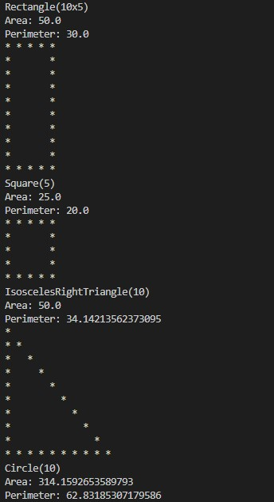

# Projects
Contains a few of the programming projects I've done 
These projects come from:
<list>
  <li>CS 1420 (U of U)</li>
  <li>CS 1400 (SLCC Concurrent Enrollement)</li>
  <li>CS 1410 (SLCC Concurrent Enrollement)</li>
</list>
Shapes will look like:

WordleClone will look like:

