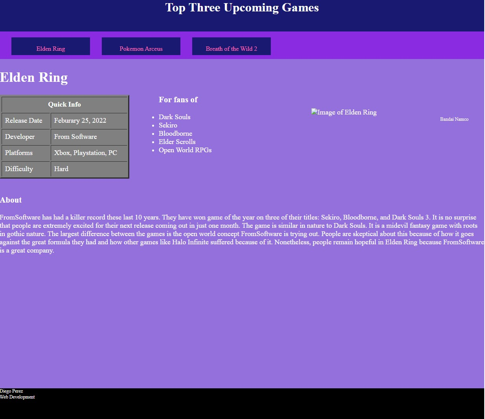

# Projects
Contains a few of the programming projects I've done 
These projects come from:
<list>
  <li>CS 1420 (U of U)</li>
  <li>CS 1400 (SLCC Concurrent Enrollement)</li>
  <li>CS 1410 (SLCC Concurrent Enrollement)</li>
</list>
<h2> WordleClone </h2>
  <b>Important Ideas:</b> Methods, Comments
   
  <b> Demonstration </b>
  
 <h2> Upcoming Games Website </h2>
  <b>Important Ideas:</b> HTML/CSS, Links, Tables, Divs, Positioning, etc.
   
  <b>Note:</b> Images have been removed for copyright reasons
    
  <b>Demonstration</b>
  
