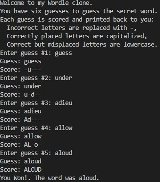

# Projects
Contains a few of the programming projects I've done 
These projects come from:
<list>
  <li>CS 1420 (U of U)</li>
  <li>CS 1400 (SLCC Concurrent Enrollement)</li>
  <li>CS 1410 (SLCC Concurrent Enrollement)</li>
</list>
<h2> Shapes </h2>
  Important ideas: Inheritance, Polymorphism, OOP, and Interfaces. 
    Will look like:
  
<h2> WordleClone </h2>
  Important Ideas: Methods, Comments
    Will look like:
  
